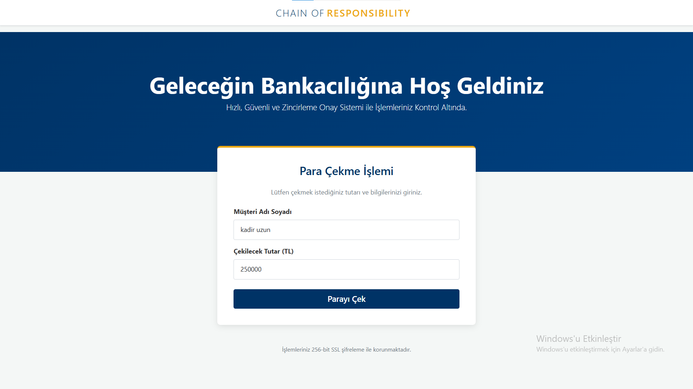
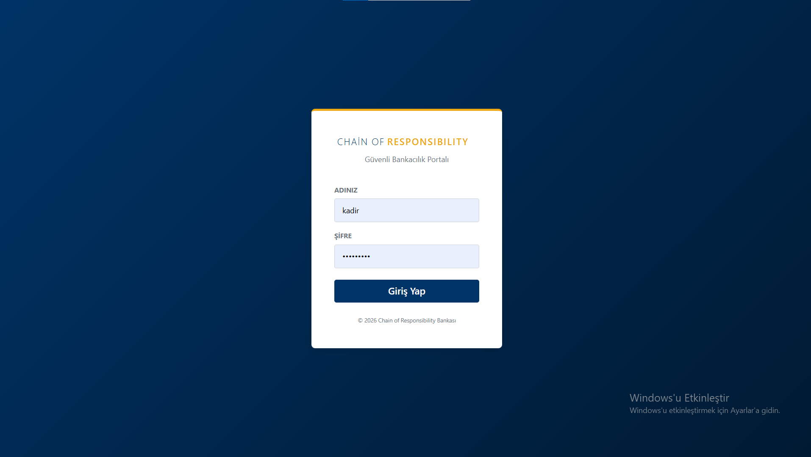
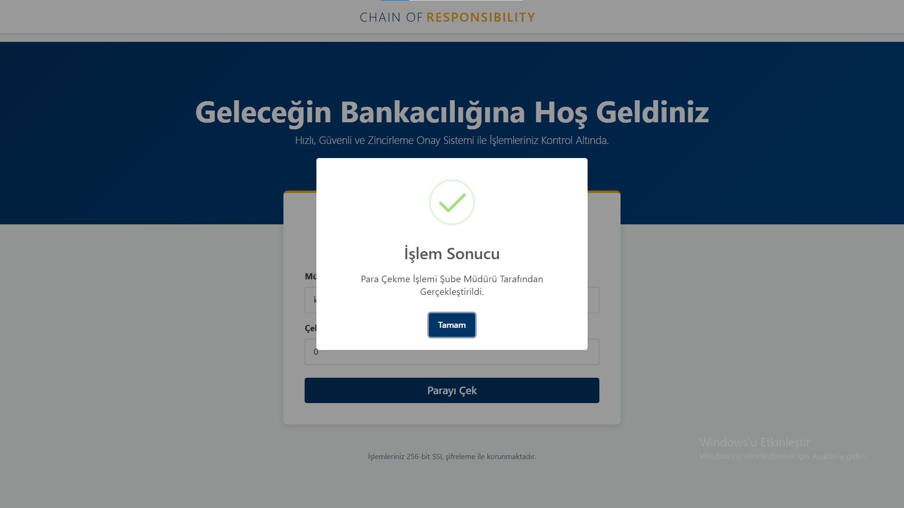
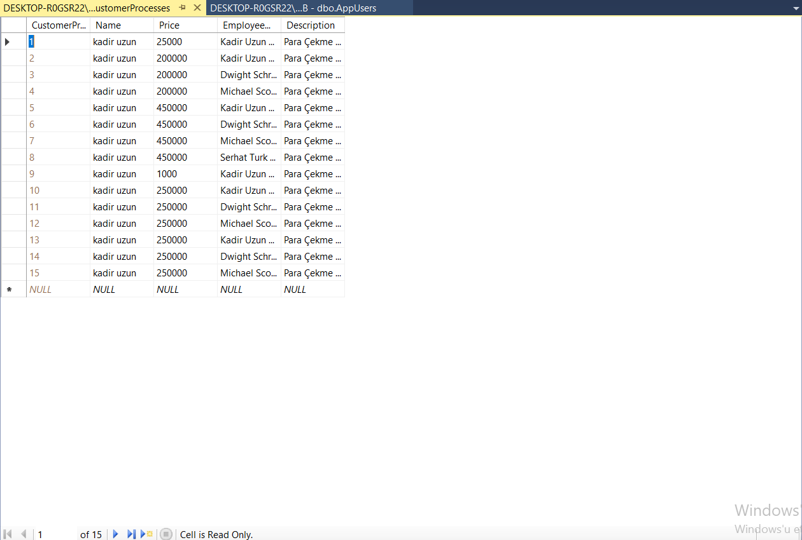

# 🏦 Chain of Responsibility - Banka Para Çekme Simülasyonu

Bu proje,**Chain of Responsibility** deseninin gerçek hayat senaryosunda nasıl uygulandığını gösteren modern bir bankacılık simülasyonudur.

Proje **.NET 8.0** ve **ASP.NET Core MVC** kullanılarak geliştirilmiştir.

---

## 🎯 Projenin Amacı ve Senaryo

Bir banka şubesinde müşterilerin para çekme taleplerini simüle eden bu sistemde, talep edilen tutara göre hiyerarşik bir onay mekanizması çalışır.

Klasik `if-else` blokları yerine, nesnelerin sorumluluğu birbirine devrettiği **Zincir Yapısı** kurulmuştur. Müşteri talebi gönderir, hangi personelin onaylayacağını bilmez; sistem otomatik olarak limiti yeten personele işlemi atar.

---

## 🔄 Zincirleme Sorumluluk İşleyişi (Workflow)

Sistemde tanımlı olan **Chain of Responsibility** hiyerarşisi şu şekildedir:

1.  **🧑‍💼 Veznedar (Treasurer):**
    * **Limit:** 50.000 TL'ye kadar.
    * *Durum:* Eğer talep bu tutarı aşarsa -> **Müdür Yardımcısı**na devreder.

2.  **👨‍💼 Müdür Yardımcısı (Assistant Manager):**
    * **Limit:** 50.001 TL - 150.000 TL arası.
    * *Durum:* Eğer talep bu tutarı aşarsa -> **Şube Müdürü**ne devreder.

3.  **👔 Şube Müdürü (Manager):**
    * **Limit:** 150.001 TL - 300.000 TL arası.
    * *Durum:* Eğer talep bu tutarı aşarsa -> **Bölge Müdürü**ne devreder.

4.  **🏢 Bölge Müdürü (General Manager):**
    * **Limit:** 300.000 TL üzerindeki tüm işlemler.
    * *Durum:* Zincirin son halkasıdır, işlemi onaylar.

---

## 🛠 Kullanılan Teknolojiler

| Kategori | Teknoloji / Kütüphane |
| :--- | :--- |
| **Framework** | .NET 8.0 / ASP.NET Core MVC |
| **Tasarım Deseni** | Chain of Responsibility Pattern |
| **Veritabanı** | MSSQL Server |
| **ORM** | Entity Framework Core (Code First) |
| **Frontend** | HTML5, CSS3, Bootstrap 5 |
| **UI Bildirimleri** | SweetAlert2 |
| **Kimlik** | Session Management |

---

## 📸 Proje Ekran Görüntüleri

### 💻 Kullanıcı Arayüzü ve Talep Ekranı

  

### 🔄 Zincirleme Onay İşleyişi 

  
  &nbsp;
  
 &nbsp;
  

*İşlemler SweetAlert2 ile dinamik bildirimler eşliğinde kullanıcıya sunulur.*

